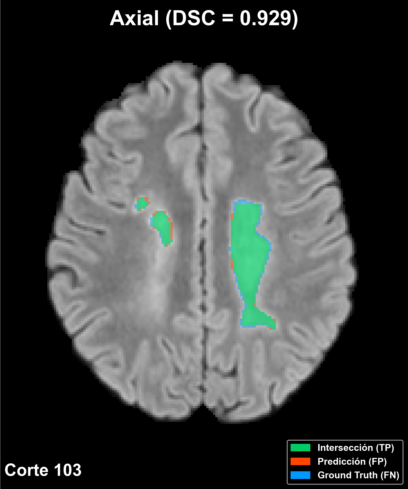
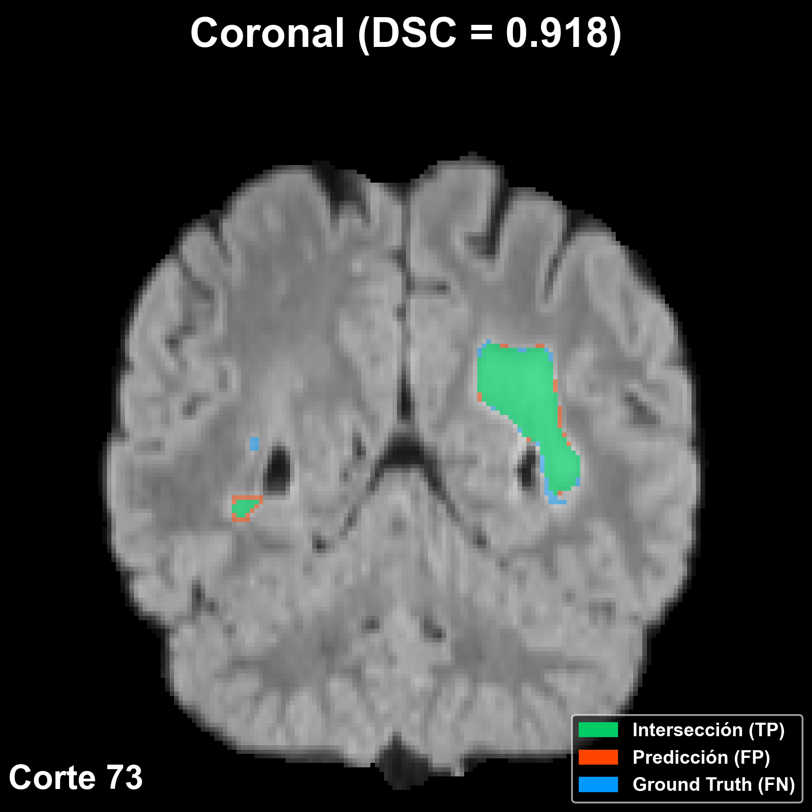
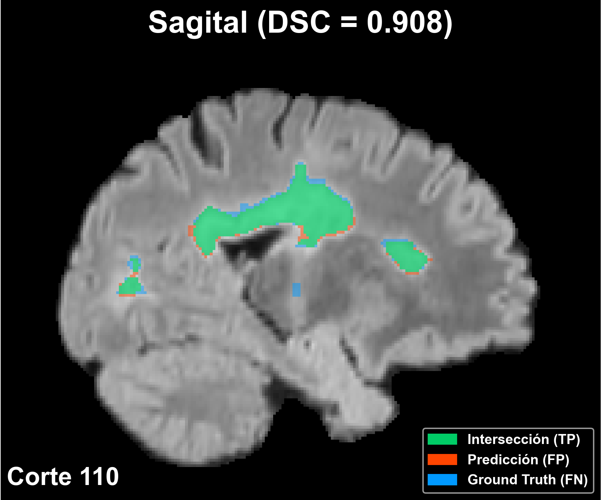
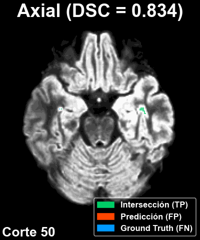

> Trabajo de Fin de Grado  
> Autor: Sebastián Rozenblum  
> Tutores: Miguel Ángel Molina Cabello, Paula Ariadna Jiménez Partinen  
> Ingeniería de la Salud · Mención en Bioinformática  
> Universidad de Málaga · Curso 2025–2026

# 🧠💻 YOLO-MSLesSeg: segmentación automática de lesiones de esclerosis múltiple con YOLO11-seg

Este proyecto implementa un pipeline completo de segmentación y evaluación de lesiones de esclerosis múltiple en
imágenes de resonancia magnética utilizando modelos
[YOLO11-seg](https://docs.ultralytics.com/es/models/yolo11/).
El trabajo se basa en el conjunto de datos de la **MSLesSeg Competition** del ICPR 2024, una competición internacional
de referencia en la validación de métodos automáticos para la segmentación de lesiones de esclerosis múltiple.  
El objetivo es contribuir en esta línea de investigación mediante un enfoque original que combina modelos de
aprendizaje profundo con distintos algoritmos de mejora de imagen, permitiendo desarrollar una herramienta reproducible
capaz de:

- Identificar y cuantificar lesiones de forma consistente.
- Reducir la variabilidad asociada a la segmentación manual.

## ⛓️ Descripción general del *pipeline*

El proceso completo consta de ocho etapas secuenciales,
automatizadas mediante el script `ejecutar_pipeline.py`:

0. Descarga y preparación del _dataset_ oficial MSLesSeg.
1. Preprocesamiento y extracción de cortes en formato compatible con el modelo YOLO.
2. Entrenamiento del modelo YOLO11-seg (_opcional_).
3. Generación de predicciones bidimensionales.
5. Reconstrucción de volúmenes tridimensionales a partir de cortes predichos.
4. Combinación de volúmenes predichos en distintos planos (consenso).
6. Evaluación cuantitativa mediante métricas de rendimiento.
7. Cálculo de resultados globales del experimento.

Cada módulo puede ejecutarse de forma independiente o a través del *pipeline* global,
lo que garantiza flexibilidad para depuración o experimentación.

---

## 🗂️ Estructura del repositorio

El repositorio se organiza de la siguiente manera:

```
📁 YOLO-MSLesSeg/                  
│
├── 📁 yolo_mslesseg/                           # Paquete principal del proyecto
│   │ 
│   ├── ejecutar_pipeline.py                    # Script para ejecutar el pipeline completo
│   │
│   ├── 📁 configs/                             # Clases de configuración por etapa
│   │   ├── ConfigSetUp.py
│   │   ├── ConfigTrain.py
│   │   ├── ConfigPred.py
│   │   ├── ConfigRecVol.py
│   │   ├── ConfigEval.py
│   │   └── ConfigConsenso.py
│   │
│   ├── 📁 scripts/                             # Scripts ejecutables que componen el pipeline
│   │   ├── setup.py
│   │   ├── extraer_dataset.py
│   │   ├── train.py
│   │   ├── generar_predicciones.py
│   │   ├── reconstruir_volumen.py
│   │   ├── generar_consenso.py
│   │   ├── eval.py
│   │   └── promediar_folds.py
│   │
│   ├── 📁 utils/                               # Utilidades y scripts auxiliares 
│   │
│   └── 📁 extras/                              # Scripts adicionales pero no esenciales
│
├── 📁 demo/                                    # Ejecuciones reducidas del pipeline para demostración simple
│
├── 📁 MSLesSeg-Dataset/                        # Dataset de entrada crudo, descargado desde el repositorio oficial (*️⃣)
│
├── 📁 datasets/                                # Datasets YOLO (*️⃣)
│
├── 📁 trains/                                  # Modelos entrenados
│
├── 📁 pred_vols/                               # Volúmenes predichos 3D (*️⃣)
│
├── 📁 results/                                 # Métricas de evaluación (*️⃣)
│
├── 📁 GT/                                      # Volúmenes ground truth (*️⃣)
│
├── 📁 visualizaciones/                         # GIFs y figuras de predicciones 2D
│
├── requirements.txt
└── README.md
```

> ℹ️ Las carpetas `configs/`, `utils/` y `extras/` contienen módulos internos utilizados por los scripts del _pipeline_.
> No es necesario acceder a ellos directamente para la ejecución del proyecto.

> ℹ️ Las carpetas marcadas con *️⃣ se generan automáticamente durante la ejecución.

---

## 🖥️ Requisitos del sistema

Para ejecutar correctamente el proyecto se requiere el siguiente entorno básico:

### Python

- Python **3.10** o superior.

### Hardware

- **GPU NVIDIA** con soporte **CUDA** (opcional pero recomendada para entrenamiento).
- **CPU de múltiples núcleos** si no se dispone de GPU.
- **8–16 GB RAM** mínimos para manejar volúmenes NIfTI.
- **3–6 GB** de espacio libre para _datasets_, modelos y predicciones.

### Software y frameworks

- PyTorch (con soporte CUDA si se usa GPU).
- Ultralytics YOLO11-seg.
- OpenCV, NumPy, NiBabel, Matplotlib y demás dependencias listadas en `requirements.txt`.

### Sistemas operativos compatibles

- macOS (Apple Silicon)
- Linux (Ubuntu recomendado)
- Windows (compatible mediante WSL2)

---

## ⚙️ Configuración del entorno

### 1. Ubicarse en la carpeta raíz del proyecto

Antes de ejecutar cualquier comando, situarse en la carpeta raíz del proyecto:

```bash
cd YOLO-MSLesSeg
```

### 2. Crear y activar entorno virtual

Se recomienda crear un **entorno virtual** dedicado al proyecto para evitar
conflictos con otras instalaciones de Python y asegurar una ejecución limpia y reproducible.

#### macOS/Linux

```bash
python3 -m venv venv_mslesseg
source venv/bin/activate
```

#### Windows (PowerShell)

```bash
python3 -m venv venv_mslesseg
venv\Scripts\activate
```

### 3. Instalar dependencias

```
pip install -r requirements.txt
```

### 4.Instalar PyTorch con GPU (_opcional_)

Si el sistema utilizado tiene una GPU NVIDIA compatible, es posible instalar PyTorch con CUDA siguiendo
las [instrucciones oficiales](https://pytorch.org/get-started/locally/).
Por defecto, la instalación funcionará en **CPU**, suficiente para predicción y evaluación.

---

## 🚀 Ejecución del _pipeline_

Una vez configurado el entorno, el _pipeline_ completo puede ejecutarse con un único comando desde la carpeta raíz del
proyecto:

```bash
python -m yolo_mslesseg.ejecutar_pipeline \
    --plano "axial" \
    --modalidad "FLAIR" \
    --mejora "CLAHE" \
    --num_cortes P50 \
    --epochs 50 \
    --completo
```

Este comando ejecuta automáticamente todas las fases del flujo.
Los resultados se almacenan en la carpeta `results/`, siguiendo la estructura definida por el repositorio.

### Parámetros de ejecución

Los siguienes argumentos permiten personalizar la ejecución de `ejecutar_pipeline.py`
y llevar a cabo experimentos para distintas configuraciones:

| Argumento           | Tipo / Valores                             | Descripción                                         | Obligatorio | Valor por defecto |
|---------------------|--------------------------------------------|-----------------------------------------------------|-------------|-------------------|
| `--plano`           | `axial`, `coronal`, `sagital`              | Plano anatómico de extracción.                      | ✅           | —                 |
| `--modalidad`       | `T1`, `T2`, `FLAIR` (múltiples permitidas) | Modalidad(es) de imagen MRI.                        | ❌           | Todas             |
| `--num_cortes`      | Entero o percentil (`PXX`)                 | Número de cortes a extraer.                         | ✅           | —                 |
| `--mejora`          | `HE`, `CLAHE`, `GC`, `LT`                  | Algoritmo de mejora de imagen.                      | ❌           | Ninguno           |
| `--k_folds`         | Entero                                     | Número de folds para validación cruzada.            | ❌           | `5`               |
| `--epochs`          | Entero                                     | Número de épocas de entrenamiento.                  | ✅           | —                 |
| `--umbral_consenso` | `2` o `3`                                  | Umbral para votación mayoritaria del consenso.      | ❌           | `2`               |
| `--completo`        | Flag                                       | Ejecutar el flujo sobre todos los pacientes.        | ✅ (❗)       | —                 |
| `--paciente_id`     | ID (`P#`)                                  | Ejecutar el flujo solo para el paciente indicado.   | ✅ (❗)       | —                 |
| `--entrenar`        | Flag                                       | Incluir la etapa de entrenamiento.                  | ❌           | `False`           |
| `--limpiar`         | Flag                                       | Limpiar todos los resultados generados previamente. | ❌           | `False`           |

> ❗️ Los argumentos `--completo` y `--paciente_id` son **mutuamente excluyentes**.  
> Solo uno de ellos puede utilizarse en cada instancia de ejecución.

> ℹ️ El entrenamiento del modelo no se ejecuta automáticamente.
> Por defecto, se omite esta etapa porque es computacionalmente intensiva.
> Esto permite acelerar la ejecución del _pipeline_ y favorecer la reproducibilidad cuando ya existen pesos entrenados.
> Para ejecutar el entrenamiento, es necesario activarlo explícitamente con el flag `--entrenar`.

---

## 🔧 Ejecución modular

También es posible ejecutar las diferentes etapas de forma individual, utilizando los _scripts_ ubicados en la carpeta
`scripts/`.  
Cada módulo (`setup.py`, `train.py`, `generar_predicciones.py`, `generar_consenso.py`,
`reconstruir_volumen.py`, `eval.py`, etc.) puede invocarse directamente desde la línea de comandos.

Los argumentos admitidos por cada script son ligeramente diferentes a los de `ejecutar_pipeline.py`. Cada archivo
incluye su propia descripción de parámetros y opciones específicas, que deben consultarse al ejecutarlo
con `--help`. Por ejemplo:

```bash
python -m yolo_mslesseg.scripts.reconstruir_volumen --help
```

## 🧪 Demo del proyecto

El repositorio incluye un modo de demostración (demo) que permite ejecutar el _pipeline_ completo sobre un conjunto
reducido
de pacientes y modelos preentrenados. La demo está diseñada para mostrar rápidamente el funcionamiento del sistema sin
necesidad de entrenar modelos ni procesar el conjunto completo.

Se encuentra en la carpeta `demo/` y dispone de su propio [README](\demo\README_demo.md) con instrucciones
detalladas. Para consultar sus particularidades, es necesario dirigirse a dicha carpeta y seguir la documentación allí
incluida.

Puede ejecutarse con el siguiente comando:

```bash
python -m demo.ejecutar_demo
```

---

## 🖼️ Ejemplos visuales

A continuación se muestran ejemplos representativos de las salidas generadas por el _pipeline_. Estas visualizaciones
permiten observar la calidad de las segmentaciones producidas por el modelo, así como su coherencia anatómica en los
distintos planos de visualización. También se incluye una secuencia animada (GIF) que recorre todos los cortes de un
paciente,
que permite apreciar la consistencia de las predicciones a lo largo de todo volumen.

### Segmentación en los tres planos anatómicos

El siguiente ejemplo corresponde a un paciente de referencia (P1, sin algoritmo de mejora).
Muestra la predicción del modelo separando TP en verde, FP en naranja y FN en azul, superpuestos sobre la imagen FLAIR
en los planos axial, coronal y sagital. Además, en cada corte se muestra el correspondiente valor del Dice Similarity
Coefficient (DSC).

<p align="center">
  
  
  
</p>

### Secuencia completa de un paciente

La siguiente animación recorre todos los cortes utilizados por el modelo para otro paciente de referencia (P42, con
ecualización de histograma, en el plano axial). Muestra la segmentación generada en el plano axial para todos los cortes
del volumen que
contienen lesión. En este caso, se incluye el valor del DSC calculado a nivel de volumen.

<p align="center">
  
</p>

---

## 🔬 Metodología y diseño experimental

Para ... , se siguió la siguiente configuración experimental:

### Dataset: MSLesSeg

Patients: 53 multiple sclerosis patients
Timepoints: Variable per patient (1-4 timepoints)
Total volumes: 147 3D MRI volumes
Modality: FLAIR (Fluid Attenuated Inversion Recovery)
Resolution: Isotropic 1mm³ voxels
Ground truth: Expert manual segmentations

### Algoritmos de mejora de imagen

Dado que una de las contribuciones originales del trabajo consiste en analizar el efecto del preprocesado sobre el
desempeño del modelo, se evaluaron cuatro técnicas clásicas de mejora de imagen:

- **HE (Histogram Equalization):** redistribuye las intensidades para aprovechar todo el rango dinámico y resaltar
  regiones poco contrastadas.
- **CLAHE (Contrast Limited Adaptive Histogram Equalization):** ecualización adaptativa por bloques, con control del
  realce para evitar amplificación de ruido.
- **GC (Gamma Correction):** transforma la luminosidad mediante una función exponencial, permitiendo resaltar regiones
  brillantes u oscuras según el valor de gamma.
- **LT (Linear Transformation):** ajuste lineal del rango dinámico, útil para normalizar intensidades y aumentar la
  homogeneidad antes de la segmentación.

Estas técnicas se aplicaron de forma independiente para analizar su influencia en el rendimiento cuantitativo y la
coherencia espacial de las predicciones.

### Validación cruzada

- **Esquema:** validación cruzada de 5 folds
- **Split a nivel paciente:** garantiza ausencia total de *data leakage* entre entrenamiento y prueba
- **Asignación estratificada:** balanceada según la severidad y distribución de las lesiones
- **Rotación completa:** cada fold actúa como conjunto de prueba una vez

Esta estrategia permite obtener una estimación robusta del rendimiento general del modelo y estudiar la variabilidad
inter-paciente bajo diferentes configuraciones experimentales.

### Métricas de rendimiento

La calidad de la segmentación se evalúa cuantitativamente mediante métricas frecuentemente utilizadas en el ámbito
biomédico:

- **Dice Similarity Coefficient (DSC)**: medida del solapamiento entre la máscara predicha y la de referencia.
- **Área bajo la curva Roc (AUC)**: medida general la capacidad del modelo para distinguir entre clases.
- **Precision**: proporción de predicciones positivas correctamente realizadas.
- **Recall**: proporción de verdaderos positivos correctamente identificados por el modelo.

---

## 📚 Referencias

- Documentación de Ultralytics YOLO11: https://docs.ultralytics.com/es/models/yolo11/.
- Competición MSLesSeg y conjunto de datos: https://www.nature.com/articles/s41597-025-05250-y.
