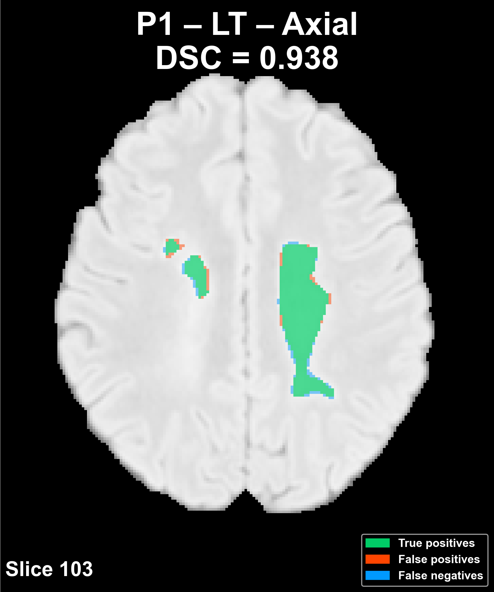
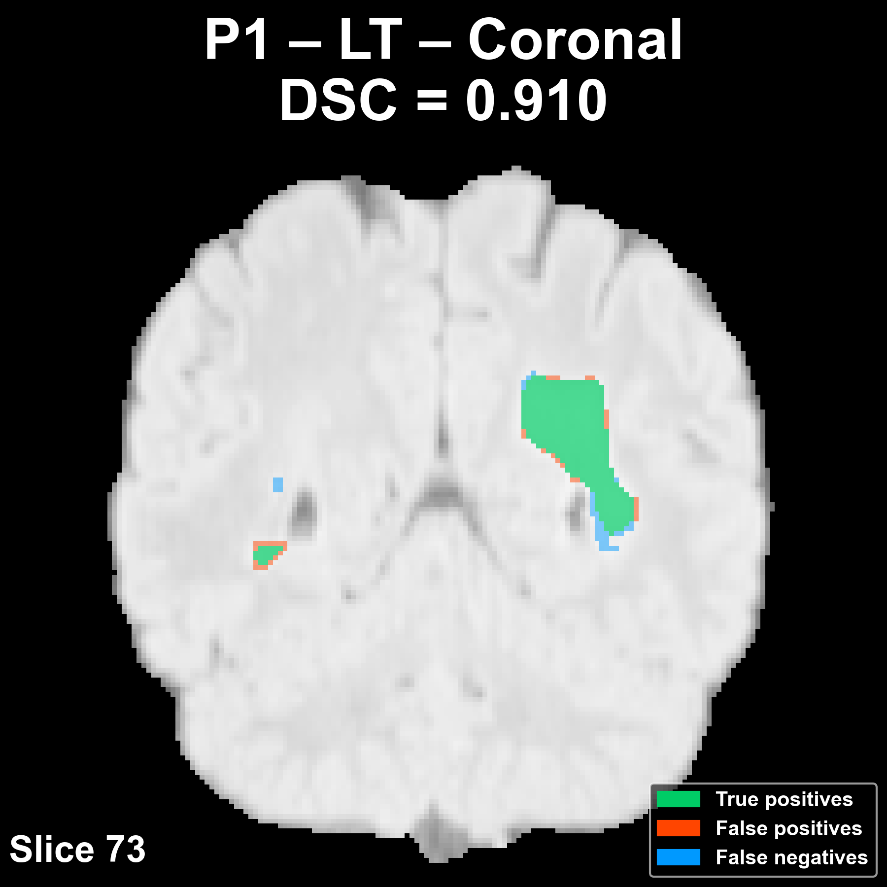
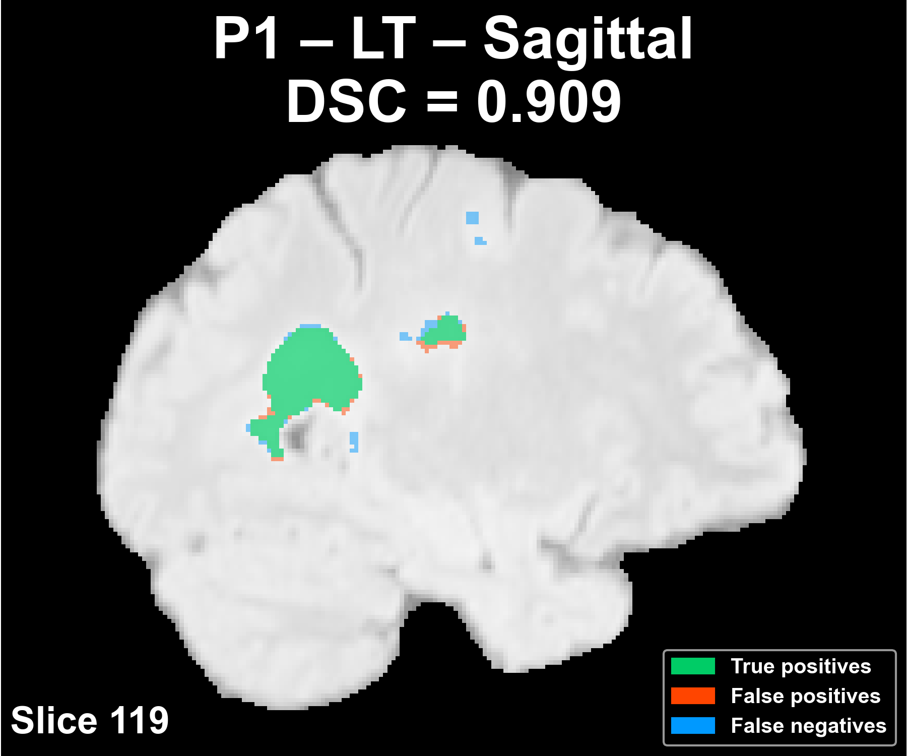
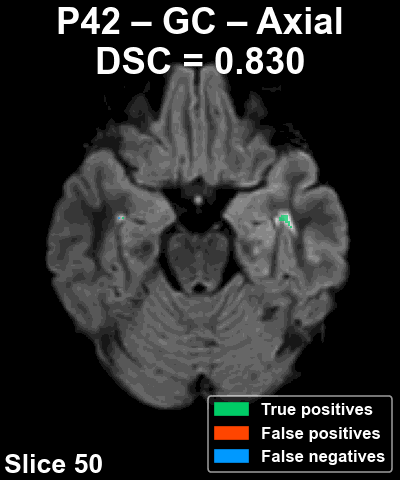

 [](https://pypi.org/project/yolo-mslesseg/) [](https://opensource.org/licenses/MIT)

# 🧠💻 YOLO-MSLesSeg: Automatic Multiple Sclerosis Lesion Segmentation with YOLO11-seg

This project implements a complete pipeline for the automatic segmentation and evaluation of multiple sclerosis
lesions in MRI images, using
[**YOLO11-seg**](https://docs.ultralytics.com/models/yolo11/) models.
The system is based on the
[**MSLesSeg Competition**](https://www.nature.com/articles/s41597-025-05250-y) (ICPR 2024) dataset, an international
benchmark for the validation of automatic methods for multiple sclerosis lesion segmentation.

The project introduces an approach that combines **deep learning models** with different **image enhancement
techniques** as a preprocessing stage, with the goal of quantifying lesions consistently and reducing
the variability associated with manual segmentation.

## 📑 Table of Contents

- [Visual examples](#-visual-examples)
- [Pipeline overview](#-pipeline-overview)
- [Repository structure](#-repository-structure)
- [System requirements](#-system-requirements)
- [Environment setup](#-environment-setup)
- [Running the pipeline](#-running-the-pipeline)
- [Stage-by-stage execution](#-stage-by-stage-execution)
- [Experimental design](#-experimental-design)
- [References](#-references)
- [License](#-license)
- [Citation](#-citation)

---

<a id="-visual-examples"></a>

## 🖼️ Visual Examples

Below are representative examples of the outputs generated by the pipeline. These visualisations allow a direct
appreciation of the type of segmentations produced by the model and their anatomical consistency across the
different viewing planes. A GIF is also included that traverses all slices of a patient,
showing the consistency of predictions across the entire volume.

### Segmentation across the three anatomical planes

The following example corresponds to a reference patient (P1) and shows the overlay of the automatic segmentation
on the FLAIR image in the axial, coronal, and sagittal planes.

<p align="center">
  
  
  
</p>

### Complete patient sequence

The following animation shows the segmentation generated for another reference patient (P42) across all slices
of the volume in the axial plane.

<p align="center">
  
</p>


---

<a id="-pipeline-overview"></a>

## 📋 Pipeline Overview

The complete process consists of eight sequential stages,
automated via the `run_pipeline.py` script:

0. Download and preparation of the official MSLesSeg dataset.
1. Preprocessing and slice extraction in a format compatible with the YOLO model.
2. Training of the YOLO11-seg model (_optional_).
3. Generation of two-dimensional predictions.
4. Reconstruction of three-dimensional volumes from predicted slices.
5. Combination of volumes predicted across different planes (consensus).
6. Quantitative evaluation using performance metrics.
7. Computation of global experiment results.

Each module can be executed independently or through the global pipeline,
ensuring flexibility for debugging or experimentation.

---

<a id="-repository-structure"></a>

## 🗂️ Repository Structure

The repository is organised as follows:

```
📁 YOLO-MSLesSeg/
│
├── 📁 yolo_mslesseg/                           # Main project package
│   │
│   ├── run_pipeline.py                         # Script to run the full pipeline
│   │
│   ├── 📁 configs/                             # Per-stage configuration classes
│   │   ├── ConfigBase.py
│   │   ├── ConfigDataset.py
│   │   ├── ConfigTrain.py
│   │   ├── ConfigPred.py
│   │   ├── ConfigReconstruction.py
│   │   ├── ConfigEval.py
│   │   └── ConfigConsensus.py
│   │
│   ├── 📁 scripts/                             # Executable scripts that make up the pipeline
│   │   ├── setup.py
│   │   ├── extract_dataset.py
│   │   ├── train.py
│   │   ├── generate_predictions.py
│   │   ├── reconstruct_volume.py
│   │   ├── generate_consensus.py
│   │   ├── eval.py
│   │   └── average_folds.py
│   │
│   ├── 📁 utils/                               # Utilities and auxiliary modules
│   │
│   └── 📁 extras/                              # Additional but non-essential scripts
│
├── 📁 tests/                                   # Unit and integration test suite
│
├── 📁 MSLesSeg-Dataset/                        # Raw input dataset, downloaded from the official repository (*️⃣)
│
├── 📁 datasets/                                # YOLO datasets (*️⃣)
│
├── 📁 trains/                                  # Trained models
│
├── 📁 pred_vols/                               # Predicted 3D volumes (*️⃣)
│
├── 📁 results/                                 # Evaluation metrics (*️⃣)
│
├── 📁 GT/                                      # Ground truth volumes (*️⃣)
│
├── 📁 visualizations/                         # GIFs and figures of 2D predictions (*️⃣)
│
├── requirements.txt
└── README.md
```

> [!NOTE]
> The `configs/`, `utils/`, and `extras/` folders contain internal modules used by the pipeline scripts.
> Direct access to them is not required to run the project.

> [!NOTE]
> Folders marked with *️⃣ are generated automatically during execution.

---

<a id="-system-requirements"></a>

## 🖥️ System Requirements

The following basic environment is required to run the project correctly:

### Python

- Python **3.10** or higher.

### Hardware

- **NVIDIA GPU** with **CUDA** support (optional but recommended for training).
- **Multi-core CPU** if no GPU is available.
- **8–16 GB RAM** minimum to handle NIfTI volumes.
- **3–6 GB** of free disk space for datasets, models, and predictions.

### Software and frameworks

- PyTorch (with CUDA support if using a GPU).
- Ultralytics YOLO11-seg.
- OpenCV, NumPy, NiBabel, Matplotlib, and other dependencies listed in `requirements.txt`.

### Compatible operating systems

- macOS (Apple Silicon)
- Linux (Ubuntu recommended)
- Windows (compatible via WSL2)

---

<a id="-environment-setup"></a>

## ⚙️ Environment Setup

### 1. Clone the repository

```bash
git clone https://github.com/srozenblum/YOLO-MSLesSeg
cd YOLO-MSLesSeg
```

### 2. Create and activate a virtual environment

A dedicated **virtual environment** is recommended to avoid
conflicts with other Python installations and ensure clean, reproducible execution.

#### macOS/Linux

```bash
python3 -m venv venv_mslesseg
source venv_mslesseg/bin/activate
```

#### Windows (PowerShell)

```bash
python3 -m venv venv_mslesseg
venv_mslesseg\Scripts\activate
```

### 3. Install dependencies

```
pip install -r requirements.txt
```

### 4. Install PyTorch with GPU (_optional_)

If the system has a compatible NVIDIA GPU, PyTorch with CUDA can be installed by following the
[official instructions](https://pytorch.org/get-started/locally/).
By default, the installation will run on **CPU**, which is sufficient for prediction and evaluation.

---

## 🚀 Running the Pipeline

Once the environment is configured, the complete pipeline can be run with a single command from the project root:

```bash
python -m yolo_mslesseg.run_pipeline \
    --plane axial \
    --modality FLAIR \
    --num_slices P50 \
    --enhancement CLAHE \
    --k_folds 5 \
    --epochs 50 \
    --full
```

This command automatically executes all phases of the workflow.
The resulting performance metrics are stored in the `results/` folder, following the structure defined by the
repository.

### Execution parameters

The following arguments allow customising the execution of `run_pipeline.py`
and carrying out experiments for different configurations:

| Argument                | Required | Default    | Description                                                                                                          |
|-------------------------|----------|------------|----------------------------------------------------------------------------------------------------------------------|
| `--plane`               | ✅ Yes    | —          | Anatomical plane: `axial`, `coronal`, or `sagittal`                                                                   |
| `--modality`            | No       | All        | MRI image modality or modalities: `T1`, `T2`, `FLAIR`                                                                |
| `--num_slices`          | ✅ Yes    | —          | Number of slices (integer or `PXX` for percentile)                                                                   |
| `--enhancement`         | No       | `None`     | Image enhancement algorithm: `HE`, `CLAHE`, `GC`, `LT`                                                               |
| `--gamma`               | No       | `2.0`      | Gamma correction factor. Only applies when `--enhancement GC`                                                         |
| `--k_folds`             | No       | `1`        | Number of folds. If `k_folds > 1`, uses cross-validation by folds; if `k_folds == 1`, uses a fixed train/test split. |
| `--epochs`              | ✅ Yes    | —          | Number of training epochs                                                                                            |
| `--full`                | ✅ One required | —     | Process all patients                                                                                                 |
| `--patient_id`          | ✅ One required | —     | Process only the specified patient (e.g. `P1`)                                                                       |
| `--train`               | No       | Not active | Include the training stage                                                                                           |
| `--clean`               | No       | Not active | Clean all previous results                                                                                           |

> [!NOTE]
> `--gamma` is only effective when `--enhancement` is set to `GC`. It is silently ignored for all other enhancement algorithms.

> [!NOTE]
> When more than one modality is specified (e.g. `--modality T1 FLAIR`), their slices are fused into a
> single 3-channel (RGB) image — one channel per modality, with the last channel repeated if fewer than
> three modalities are provided. This format is directly compatible with YOLO's native 3-channel input,
> allowing the model to learn jointly from all available modalities without generating multiple files per
> slice.

> [!IMPORTANT]
> The `--full` and `--patient_id` arguments are **mutually exclusive**.
> Only one of them can be used in each pipeline execution.

> [!IMPORTANT]
> Restrictions when `--k_folds == 1`:
> - Training uses the fixed split `train/` → training and `test/` → evaluation.
> - The prediction, reconstruction, consensus, and evaluation stages only allow patients from the `test/` set.
> - No fold averaging is performed (no folds exist in this mode).

> [!NOTE]
> Model training is not executed automatically.
> By default, this stage is skipped because it is computationally intensive.
> This allows faster pipeline execution and favours reproducibility when trained weights already exist.
> To run training, it must be explicitly activated with the `--train` flag.

---

## 🔧 Stage-by-stage Execution

Individual pipeline stages can also be run independently using the scripts located in the
`yolo_mslesseg/scripts/` folder. Each module (`extract_dataset.py`, `train.py`, `generate_predictions.py`,
`generate_consensus.py`,
`reconstruct_volume.py`, `eval.py`, etc.) can be invoked directly from the command line.

The arguments accepted by each script differ slightly from those of `run_pipeline.py`. Each file
includes its own parameter description and specific options, which should be consulted by running it
with `--help`. For example:

```bash
python -m yolo_mslesseg.scripts.reconstruct_volume --help
```

## 🔬 Experimental Design

The pipeline is evaluated on the MSLesSeg dataset using two complementary evaluation schemes and standard
biomedical segmentation metrics. The full experimental design is documented in
[`docs/experimental_methodology.md`](docs/experimental_methodology.md).

---

## 📚 References

- Ultralytics (2025). YOLO11 documentation.
- Guarnera, F., Rondinella, A., Crispino, E., et al. (2025).
  MSLesSeg: Baseline and benchmarking of a new Multiple Sclerosis lesion segmentation dataset.
  *Scientific Data*, 12, 920. https://doi.org/10.1038/s41597-025-05250-y.

---

## 📄 License

This project is licensed under the [MIT License](LICENSE).

---

## 📖 Citation

If you use this work, please cite the following paper:

```bibtex
@inproceedings{rozenblum2026yolomslesseg,
    author    = {Jiménez-Partinen, Ariadna and Rozenblum, Sebastián and
                 Pascual-González, Mario and Ordóñez-Walkowiak, María Paulina and
                 Guirado-Osorio, Víctor and Molina-Cabello, Miguel A.},
    title     = {{YOLO-MSLesSeg}: Automated Multiple Sclerosis Lesion Segmentation
                 in {MRI} with Image Enhancement Techniques},
    booktitle = {Soft Computing Models in Industrial and Environmental Applications},
    series    = {Communications in Computer and Information Science},
    volume    = {3046},
    pages     = {574--585},
    publisher = {Springer, Cham},
    year      = {2026},
    doi       = {10.1007/978-3-032-29254-4_46}
}
```
