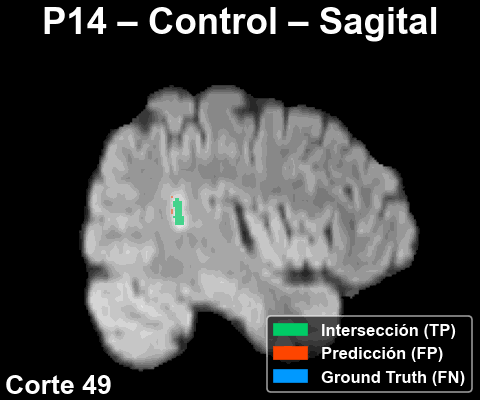

# 🧪 Demo del proyecto

Esta carpeta contiene una demostración simplificada del _pipeline_.
El objetivo es permitir una ejecución rápida, controlada y completamente autónoma sin
necesidad de entrenar modelos, descargar el _dataset_ completo ni configurar experimentos avanzados.

Con el fin de presentar los casos más representativos, la demo incluye una selección de dos pacientes.
Cada configuración fue elegida a partir del análisis de rendimiento del diseño experimental propuesto, realizado
mediante
el script `analizar_pacientes_dsc.py`. Concretamente, la ejecución se
realiza para:

- **Paciente con mayor DSC**: P14, sin algoritmo de mejora, en el plano sagital.
- **Paciente con menor DSC**: P18, con ecualización de histograma (HE), en el plano axial.

La demo es completamente autónoma, pero conserva la misma lógica de funcionamiento que el _pipeline_ completo.
Para más detalles sobre el sistema general, consultar el [README](../README.md) de la raíz del repositorio.

## 🗂️ Contenido de la carpeta

La carpeta `demo/` contiene los elementos para una demostración
autónoma, incluyendo las carpetas de los pacientes del _dataset_ de entrada MSLesSeg
y los modelos preentrenados.

```
📁 demo/
├── ejecutar_demo.py                            # Script principal de ejecución de la demo
│
├── 📁 MSLesSeg-Dataset/                        # Subconjunto del dataset original (solo los pacientes utilizados en la demo)
│
├── 📁 datasets/                                # Datasets YOLO (*️⃣)
│
├── 📁 trains/                                  # Modelos entrenados (solo los utilizados en la demo)
│
├── 📁 pred_vols/                               # Volúmenes predichos 3D (*️⃣)
│
├── 📁 results/                                 # Métricas de evaluación (*️⃣)
│
├── 📁 GT/                                      # Volúmenes ground truth (*️⃣)
│
├── 📁 visualizaciones/                         # GIFs y figuras de predicciones 2D
│
└── README_demo.md                
```

> [!NOTE]
> Las carpetas marcadas con *️⃣ se generan automáticamente durante la ejecución.

## ▶️ Instrucciones de ejecución

Desde la carpeta raíz del repositorio, ejecutar la demo con el siguiente comando:

```bash
python -m demo.ejecutar_demo
```

> [!IMPORTANT]
> En este caso no hay parámetros CLI, ya que todos los argumentos están predefinidos para la ejecución reducida.

## 📊 Resultados de ejecución

Tras la ejecución, las métricas de rendimiento para cada instancia se encuentran en la carpeta `results/`:

| Paciente | Plano   | Mejora  | DSC   | AUC   | Precisión | _Recall_ |
|----------|---------|---------|-------|-------|-----------|----------|
| **P14**  | Sagital | Ninguna | 0.685 | 0.778 | 0.889     | 0.557    |
| **P18**  | Axial   | HE      | 0.115 | 0.533 | 0.443     | 0.066    |

Además, dentro de la carpeta `visualizaciones/` se generan
animaciones que permiten inspeccionar la segmentación a lo largo del volumen:

<p align="center">


</p>
